# [ Web ] Baby Web

## Description

I will launch my first To-Do service soon. Could you find a vulnerability in my service and report it?

http://15.165.19.216:18080

## Attachment

- [attachment.zip](./attachment.zip)

## Recon

First we are given a web service also with that source code. When I first opened it, the website will display like this

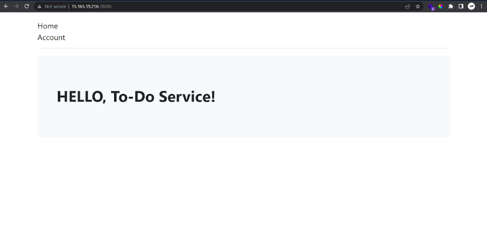

Then, after I look around in this website, this website have this features

- Authentication (sign in & sign up)
- Create/make ToDo
- Upload some file related to one ToDo
- View todo

## Explore Source Code

FYI, I have spent countless hours looking at the source code and finding the bug or vulnerability in the website.

Long story short after I look around the source code and check the routes, actually this website have an additional feature to print or see the RSS of the ToDo

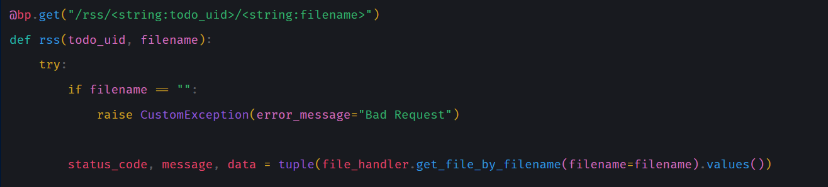

But, too see the RSS, we must upload some file related to that ToDo, so after upload the file we can see the RSS page

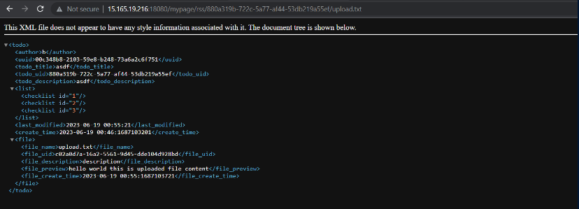

This is sus, why? because this will print or display the XML code, and the data is related to the ToDo data. So, after that I try to check the functionality of upload file.

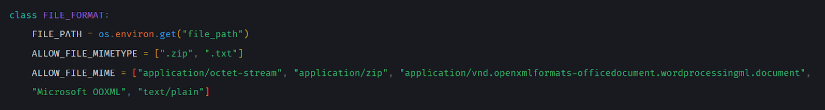

Based on code above, the allowed file to upload is .zip dan .txt file, and also check some mime type of file.

Then I continued to look the other code, and find this interesting code

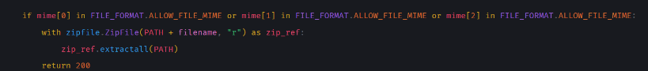

This code actually will extract all data inside the zip, so If I try to upload zip then the script will extract all files inside of my uploaded zip file, hmmmmm interesting. But why? let’s move around

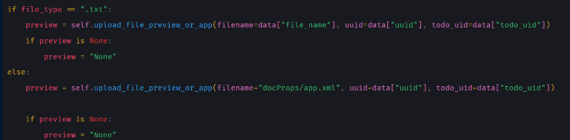

In the code above, will processing behavior of previewing content inside of file that we upload, the interesting is when the file is not .txt it will try to preview file docProps/app.xml in the current location of the uploaded ToDo file location


Woww!!! If you can see, if the filename is docProps/app.xml it will try to parse its content inside the file, hmmmmm I suggest this will make some XXE Vulnerability.

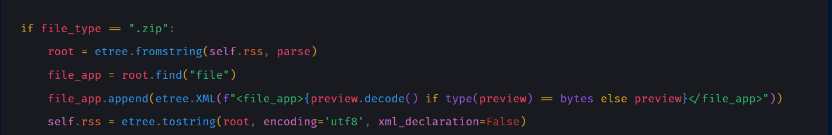

So if the file is .zip it will display the preview content, if it is present actually.

Oke, got it!

## Reference

I have some searching about XXE (XML External Entity), and I found very useful article

https://book.hacktricks.xyz/pentesting-web/xxe-xee-xml-external-entity

The payload is like this

```xml
<?xml version="1.0" encoding="UTF-8"?>
<!DOCTYPE hack [<!ENTITY exploit SYSTEM "/etc/passwd"> ]>
<data>&exploit;</data>
```

## Exploit

So the exploit is to try to make an XXE via parsing content of file docProps/app.xml, but how? If you remember, the code will extract all files inside of the uploaded zip file.

So the exploit scenario is like this

- In my computer make folder docProps
- Create file app.xml inside folder docProps
- Archive docProps folder to zip file
- Upload the zip file into the website
- Read the RSS

I will insert the XXE injection inside the app.xml, and read the flag at /flag, based on Dockerfile setting

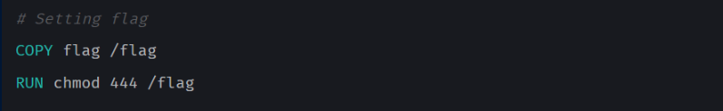

So the structure fill look like this

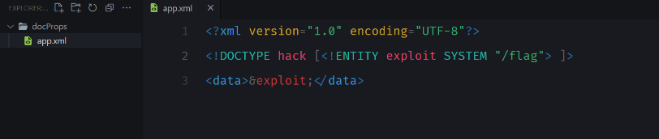

Packed it into zip file

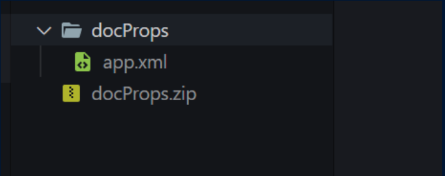

Then upload the zip file, and read RSS, then boom we can get the flag!!!

## Result

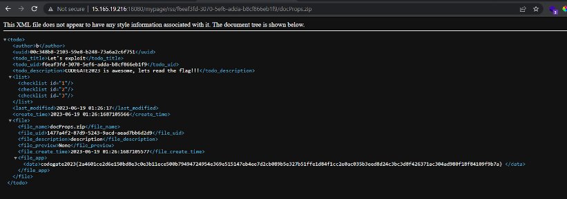

## Flag

codegate2023{2a4601ce2d6e150bd8e3c0e3b11ece500b79494724954e369e515147eb4ee7d2cb089b5e327b51ffe1d84f1cc2e0ac035b3eed8d24c3bc3d8f426371ac304ad980f18f84109f9b7a}